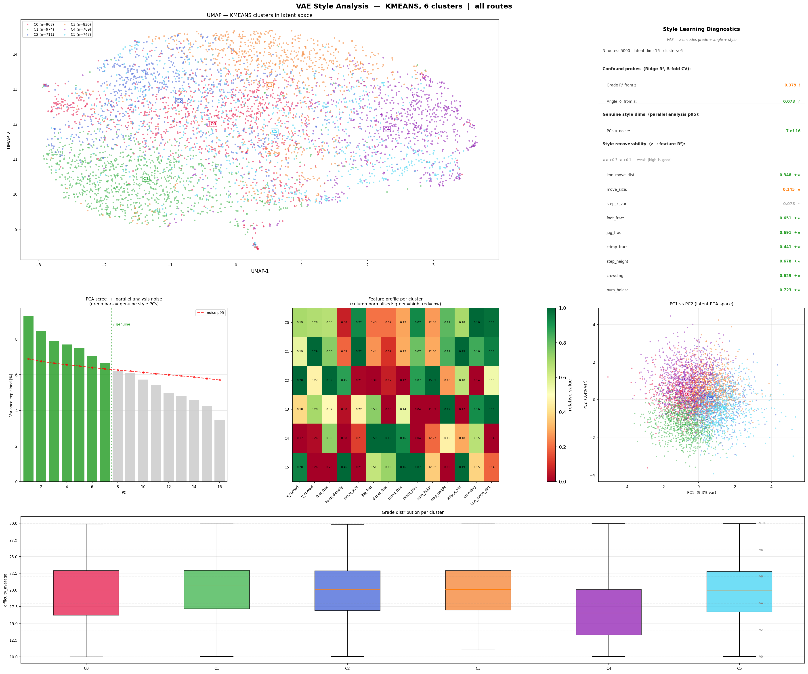
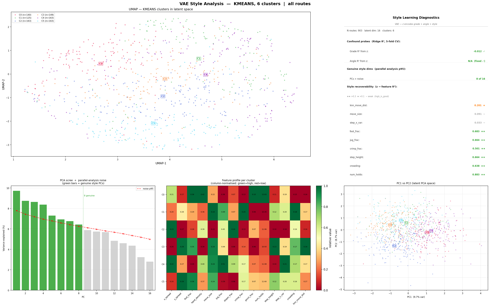

# JustGoUpAI

JustGoUpAI is a machine learning project built for climbers to augment their Kilter board training!

Route style is continuous — most climbs blend multiple movement qualities rather than belonging cleanly to one category. The latent space reflects this: routes lie along a smooth manifold where neighbours share genuine stylistic similarity and cluster boundaries are soft.

**Analysis** — a VAE encoder maps every route to a 16D style vector `z`, enabling:
- Style clustering: group routes by movement feel (dynamic, crimpy, footwork-heavy)
- Route similarity search: find climbs with genuinely similar style in latent space
- Style profiling: characterise what makes each cluster distinctive across grip type, foot density, move size

**Generation** (in progress) — a NAT decoder conditioned on `z` produces new routes, enabling:
- Style-conditioned generation: sample from a cluster and decode to a novel climb
- Route interpolation: blend two routes' style vectors to produce a hybrid
- Style variation: perturb a route's `z` to generate similar alternatives
- Partial route completion: aid route setters by completing partial climbs given some holds already placed

**Personalisation** (future) — connecting send history to the analysis encoder:
- Anti-style detection: identify style clusters a climber rarely visits
- Weakness-targeted generation: produce routes that deliberately target gaps in a training diet

---

## Data sources

Primary data source:

https://github.com/lemeryfertitta/BoardLib
Unofficial wrapper to interact with Board APIs

Auxiliary metadata source:

https://github.com/Rundstedtzz/climbology/tree/main?tab=readme-ov-file
Contains labelled data for the standard 12x12 Kilter board holds

---

## Architecture overview

```
SQLite DB (kilter_database.sqlite)
    └─ database_interfaces/board_lib_interface.py   ← thin DB wrapper
        └─ data_preprocessing/route_preprocessing.py  ← builds RouteSample list + vocabs
            └─ model_training/train_route_cvae.py      ← trains VAE, saves checkpoint
                └─ data_analysis/routes_cluster.py   ← extracts latents, KMeans or HDBSCAN
                    ├─ data_analysis/routes_visualize.py         ← PCA / UMAP / t-SNE scatter
                    ├─ data_analysis/style_analysis.py           ← cluster style profiling
                    └─ data_analysis/route_neighbor_analysis.py  ← z-space neighbor validation
src/route_visualizer.py  ← standalone board image renderer (clickable from scatter plots)
```

The **VAE model** (`RouteConditionalVAE`) pairs one encoder with one decoder:

```
RouteConditionalVAE
  ├── Encoder (choose one):
  │     RouteTransformerEncoder  — bidirectional transformer over per-hold tokens
  │     RouteMlpEncoder          — shallow MLP over the 9D shape_desc (baseline)
  ├── RouteVAEBottleneck         — MLP → (mu, logvar) → reparameterised z [B, latent_dim]
  └── Decoder (choose one):
        RouteTransformerDecoder  — transformer cross-attending z; two modes:
          · AR mode   (mask_rate=0)   — autoregressive with causal self-attention
          · NAT mode  (mask_rate>0)   — masked bidirectional; no causal mask, mask_token injection
        RouteParallelDecoder     — non-autoregressive MLP, predicts all positions independently from z
```

The transformer encoder + parallel decoder is the primary model for latent space analysis. Using a MLP decoder prevents posterior collapse and forces z to learn style. The generator model uses the frozen analysis encoder and NAT decoder. The MLP encoder and parallel decoder also act as fast baselines for ablation.

---

## Feature engineering

### Quality filtering

Only publicly available routes are used. Routes are filtered by `quality_average` and `ascensionist_count` — training is intentionally biased toward established routes with strong community consensus.

### Per-hold token construction

Each hold is embedded as a single token by independently embedding all features, concatenating them, and projecting to `d_model` via a linear layer (`HoldTokenEmbedder`).

**Encoder token** (120 dims → projected to d_model):

| Feature | Dims | Encoding |
|---------|------|----------|
| type | 32 | learned embedding (jug / sloper / crimp / pinch / foot / …) |
| role | 8 | learned embedding (hand / foot / start / finish) |
| hole_id | 16 | learned embedding (593-way vocab) |
| depth | 8 | learned embedding |
| orientation sin/cos | 8+8 | sinusoidal |
| size | 8 | learned embedding |
| x sin/cos | 16 | sinusoidal positional on normalised coordinate |
| y sin/cos | 16 | sinusoidal positional on normalised coordinate |

Note: The embedding dimensions have additional capacity which could be optimized, but has low practical cost as is.

### Route-level shape descriptor

A 9-dimensional summary of the full hold set (CLS token) is prepended to the sequence as a learned shape token, giving every per-hold representation access to global route context through transformer self-attention, providing an initial signal to speed up training:

| Dim | Feature |
|-----|---------|
| 0 | x-spread (std / board_x_span) |
| 1 | y-spread (std / board_y_span) |
| 2 | foot fraction |
| 3 | hand density (hand holds / 20) |
| 4 | mean move norm |
| 5 | jug fraction |
| 6 | sloper fraction |
| 7 | crimp fraction |
| 8 | pinch fraction |

---

## Model design decisions

### Preventing posterior collapse

Without explicit safeguards the decoder can reconstruct routes from the teacher-forced token sequence alone, ignoring `z` entirely. Two mechanisms prevent this:

**Free bits** (`--free-bits`, recommended 1.0): each latent dimension's KL is clamped from below at 1.0 nats before summing. With `latent_dim=16` this forces KL ≥ 16.0 nats total, making full collapse infeasible.

**Decoder token dropout** (`--decoder-token-dropout`, recommended 0.5): during training, each decoder input token at positions 1+ is replaced with a learned `mask_token` embedding with probability 0.5. This forces the decoder to rely on `z` for hold structure rather than exploiting teacher-forced context. Dropout is disabled at inference.

### Route embedding pooling

`route_embedding` — the vector passed into the VAE bottleneck — is produced by concatenating the **mean and max** of all hold token outputs (shape token at position 0 excluded), then projecting through `Linear(2 × d_model, d_model)`. This `mean_max` pooling preserves both the average character of the route and its extremes (most unusual hold), giving the bottleneck a richer summary than either mean-only or CLS-only pooling.

### KL scheduling

KL pressure is ramped up gradually during training (`--kl-warmup-epochs`) so the model first learns reconstruction, then is pushed toward a smooth, informative latent space. `--kl-beta` (typically 0.03–0.1) keeps beta below 1.0 to preserve style capacity in `z` relative to a standard VAE.

---

## Clustering and analysis

### Cluster cache

`routes_cluster.py` loads a trained checkpoint, encodes all routes, standardises the latent vectors, and saves a `.pt` cluster cache. Every downstream tool reads from this cache — the model is never reloaded after this step.

Supported clustering methods:
- **KMeans** — fast, simple, works well for spherical cluster geometry
- **HDBSCAN with UMAP pre-reduction** — originally motivated by arc-shaped manifold geometry that appeared when grade/angle leaked into z; UMAP unfolds curved structure before HDBSCAN finds density-based clusters without requiring a fixed cluster count; less critical with the current unconditional VAE but still available

### Style analysis (`style_analysis.py`)

Profiles each cluster's movement character along interpretable style axes:
- Ridge regression probe: how well do aggregate features predict grade, hold count, and spatial spread from `z`? Reports R² and flags genuinely informative principal components
- Per-cluster feature heatmap: z-score normalised means across foot fraction, move size, hold density, grip composition, etc.
- Grade distribution per cluster
- PCA scatter coloured by cluster

---

## Setup

Requirements:

- Python >= 3.13
- Dependencies listed in [pyproject.toml](pyproject.toml)

---

## Usage

### 1) Train VAE

```bash
python src/model_training/train_route_cvae.py \
  --latent-dim 16 --free-bits 1.0 --kl-beta 0.1 \
  --decoder-token-dropout 0.5
```

Key options:

| Flag | Purpose |
|------|---------|
| `--rebuild-cache` | Regenerate preprocessed route cache from DB |
| `--resume` / `--resume-path` | Continue training from checkpoint |
| `--transfer-encoder-only` | Load encoder+bottleneck only; reinitialise decoder (use when decoder architecture changes) |
| `--freeze-encoder` | Keep encoder weights fixed while training decoder |
| `--reset-best-val` | Reset best-val tracking when resuming |
| `--latent-dim` | Latent space dimensionality (recommended 16) |
| `--free-bits` | Minimum KL per latent dim in nats (recommended 1.0) |
| `--kl-beta` | KL weight (recommended 0.03–0.1) |
| `--kl-warmup-epochs` | Epochs to ramp KL from 0 to `kl_beta` |
| `--decoder-token-dropout` | Fraction of decoder input tokens masked during training (recommended 0.5) |
| `--decoder-mask-rate` | Alternative: mask this fixed fraction of tokens regardless of position |
| `--numeric-weight` | Weight on coordinate MSE in reconstruction loss |
| `--move-vector-weight` | Additional loss on move-vector MSE (scaled by `numeric_weight`) |
| `--hole-loss-weight` | Weight on hole-ID cross-entropy (reduce from 1.0 to shift gradient toward spatial structure) |
| `--encoder-d-model` / `--encoder-nhead` / `--encoder-num-layers` | Encoder transformer size |
| `--decoder-d-model` / `--decoder-num-layers` | Decoder transformer size |
| `--use-type-feature` / `--no-use-type-feature` | Toggle hold-type embedding (changing this requires `--rebuild-cache`) |
| `--use-absolute-pos` / `--no-use-absolute-pos` | Toggle sinusoidal x/y embeddings |
| `--mlp-encoder` / `--no-mlp-encoder` | Use MLP encoder baseline instead of transformer encoder |
| `--parallel-decoder` / `--no-parallel-decoder` | Use non-autoregressive parallel MLP decoder instead of transformer decoder |

### 2) Cluster the latent space

```bash
# K-means (6 clusters, all routes)
python src/data_analysis/routes_cluster.py \
  --method kmeans --n-clusters 6 \
  --cluster-cache-path data/routes_kmeans_original.pt

# K-means filtered to V6 @ 40°
python src/data_analysis/routes_cluster.py \
  --method kmeans --n-clusters 6 \
  --min-grade 22 --max-grade 22 --min-angle 40 --max-angle 40 \
  --cluster-cache-path data/routes_v6_40deg_kmeans.pt

# HDBSCAN with UMAP pre-reduction (recommended for manifold data)
python src/data_analysis/routes_cluster.py \
  --method hdbscan --pre-reduce --pre-reduce-method umap --pre-reduce-dims 5 \
  --umap-n-neighbors 50 --umap-min-dist 0.0 \
  --hdbscan-min-cluster-size 200 --hdbscan-min-samples 15 --no-noise \
  --cluster-cache-path data/routes_hdbscan_umap.pt
```

### 3) Visualize clustered latents

```bash
python src/data_analysis/routes_visualize.py --method pca  --cluster-cache-path data/routes_kmeans_original.pt --show
python src/data_analysis/routes_visualize.py --method umap --cluster-cache-path data/routes_hdbscan_umap.pt --show
python src/data_analysis/routes_visualize.py --method tsne --cluster-cache-path data/routes_kmeans_original.pt --show

# 3D rotatable plot
python src/data_analysis/routes_visualize.py --method umap --cluster-cache-path data/routes_kmeans_original.pt --n-dims 3 --show
```

Click any point in the scatter plot to render that route on a board image. Add `--n-dims 3` for a rotatable 3D projection (default is 2).

### 4) Style analysis

```bash
python src/data_analysis/style_analysis.py \
  --cluster-cache-path data/routes_v6_40deg_kmeans.pt \
  --output-path data/style_analysis.png
```

Produces a multi-panel figure (UMAP scatter, PCA variance, feature heatmap, PCA scatter, grade distributions, Ridge diagnostics) and prints a per-cluster summary table to stdout.

### 5) Neighbor analysis

```bash
python src/data_analysis/route_neighbor_analysis.py \
  --cluster-cache-path data/routes_kmeans_original.pt \
  --climb-name "Alberts dream" --climb-name "undermine" \
  --k 5 --max-routes 1500

# Random queries instead of named climbs
python src/data_analysis/route_neighbor_analysis.py \
  --cluster-cache-path data/routes_kmeans_original.pt \
  --num-random-queries 5 --k 5 --n-pairs 200
```

### 6) Visualize a single route

```bash
python src/route_visualizer.py --climb-name "Alberts dream"
```

---

## Latent space analysis

Analysis figures are generated with `style_analysis.py` from cluster caches built using `analysis_model.pt` (transformer encoder + parallel MLP decoder, latent_dim=16, epoch 368). All figures use K-means with 6 clusters.

### Global — all routes (n=5,000)



Key diagnostics:
- **Grade R² from z**: 0.38 — grade is moderately recoverable from latent, not dominant
- **Genuine style PCs**: 7/16 — latent space carries more than just difficulty signal
- **Strongly encoded features** (R² ≥ 0.3): `num_holds` (0.72), `jug_frac` (0.69), `step_height` (0.68), `foot_frac` (0.65), `crowding` (0.63), `crimp_frac` (0.44), `knn_move_dist` (0.35)

---

### Micro — V6 @ 40° (n=903, all available)



With grade and angle held constant, the latent space organises purely around movement style

Key diagnostics:
- **Genuine style PCs**: 8/16 — more style PCs than in the global case (no difficulty gradient consuming capacity)
- **Strongly encoded features** (R² ≥ 0.3): `num_holds` (0.88), `foot_frac` (0.68), `jug_frac` (0.66), `step_height` (0.66), `crowding` (0.64), `crimp_frac` (0.50), `knn_move_dist` (0.20)

To regenerate:

```bash
# Global (5,000 routes)
python src/data_analysis/routes_cluster.py \
  --checkpoint-path data/models/analysis_model.pt \
  --method kmeans --n-clusters 6 --max-routes 5000 \
  --cluster-cache-path data/analysis/global_kmeans.pt

python src/data_analysis/style_analysis.py \
  --cluster-cache-path data/analysis/global_kmeans.pt \
  --output-path data/analysis/style_global.png

# V6 @ 40° (all ~903 available routes)
python src/data_analysis/routes_cluster.py \
  --checkpoint-path data/models/analysis_model.pt \
  --method kmeans --n-clusters 6 --max-routes 5000 \
  --min-grade 22 --max-grade 22 --min-angle 40 --max-angle 40 \
  --cluster-cache-path data/analysis/v6_40deg_kmeans.pt

python src/data_analysis/style_analysis.py \
  --cluster-cache-path data/analysis/v6_40deg_kmeans.pt \
  --output-path data/analysis/style_v6_40deg.png \
  --no-grade-panel
```

---

## Current status

**Analysis pipeline** — complete end-to-end:
- VAE encoder produces a 16D style latent `z` per route, independent of grade and angle
- KMeans and HDBSCAN+UMAP clustering with reusable `.pt` cluster caches
- Style profiling via Ridge regression probes and feature heatmaps (`style_analysis.py`)
- z-space neighbor validation against Earth Mover's Distance ground truth (`route_neighbor_analysis.py`)
- PCA / UMAP / t-SNE scatter visualization with optional 3D projection and click-to-render

**Generation pipeline** — functional baseline:
- NAT decoder conditioned on frozen analysis encoder's `z` can reconstruct and generate routes
- Style-conditioned generation by sampling near cluster centroids

## Future goals

**Personalisation**
- Connect send history to the analysis encoder to build per-climber style profiles
- Anti-style detection: surface style clusters the climber rarely visits
- Weakness-targeted route generation: sample from underrepresented style regions

**Generation quality**
- Make decoded routes feel more climbable and intentional (hold sequencing, reachability)
- Grade transfer: encode a route's style at one grade, shift difficulty, decode
- Route completion: given partial holds already placed, condition `z` to suggest the remainder
- Evaluation metrics for novelty, feasibility, and difficulty calibration

**Productisation**
- Expose route search, similarity, and generation through a web app
- Tighten experiment tracking for model/data/version comparisons

---

## Notes

This is an active project. Data assumptions, filters, and model interfaces may evolve as experiments continue.
